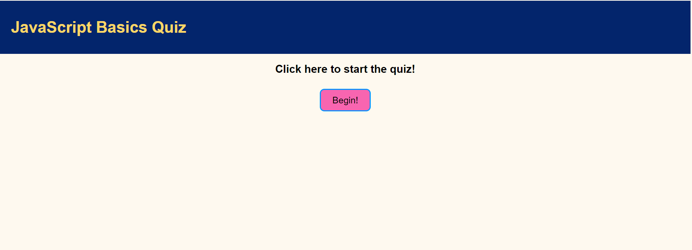

# A Quiz For The JavaScript Bare Basics!

## Purpose
It seems that the logical thing to do in ones 4th week of writing code would be to build a rudimentary JavaScript quiz! And though it may be just that (rudimentary), I hope you enjoy playing the game.

## Built With
* HTML
* CSS
* JavaScript

## Website

https://samvrny.github.io/javascript-basics-test/

Here is a look at the finished page!

## Contribution
Made by Samuel Varney